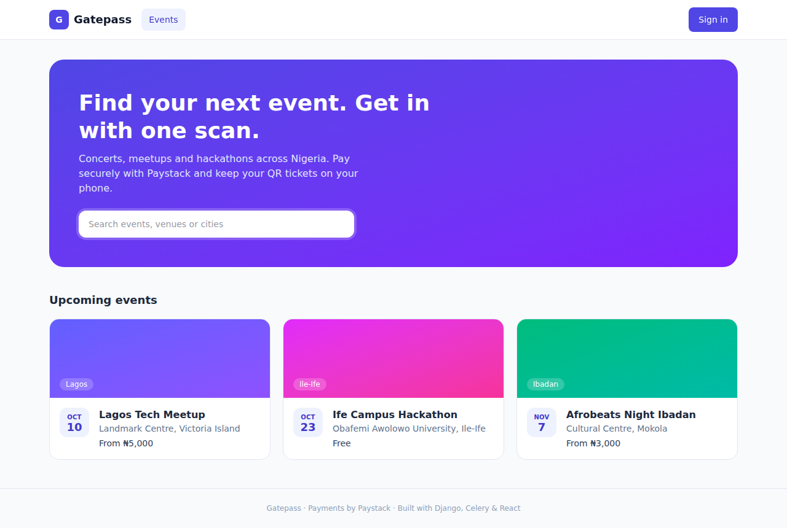
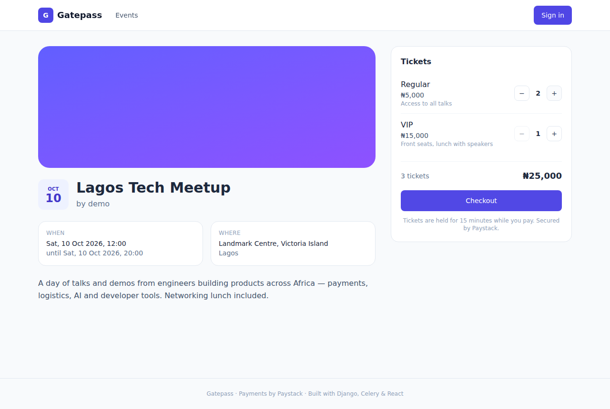
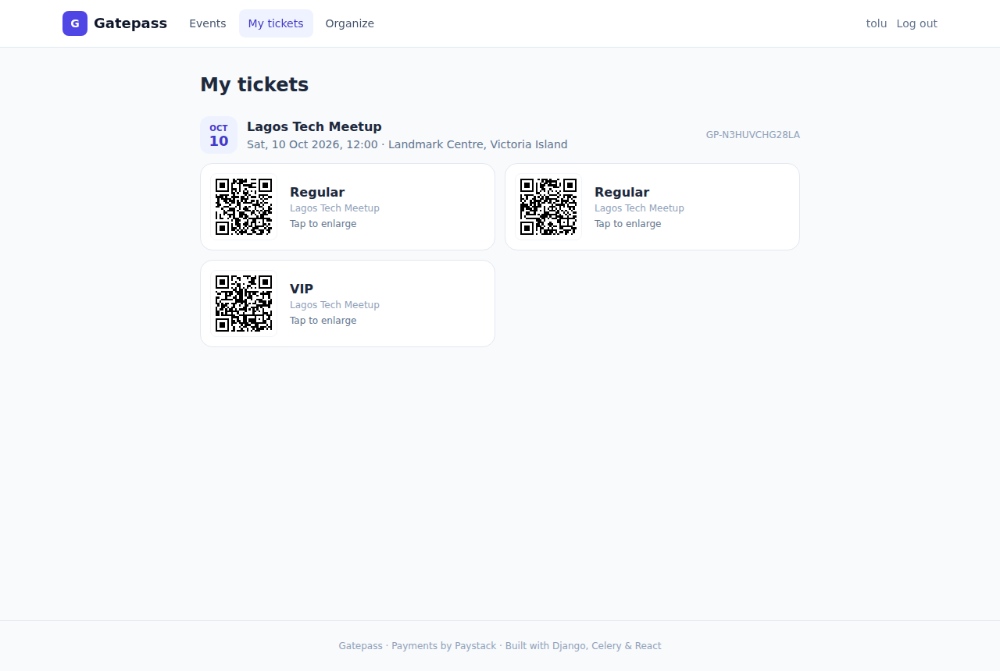
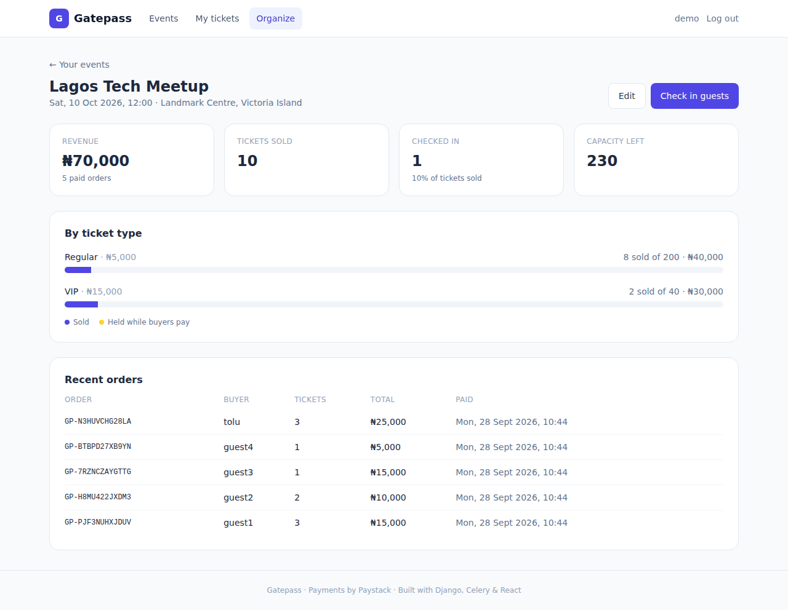
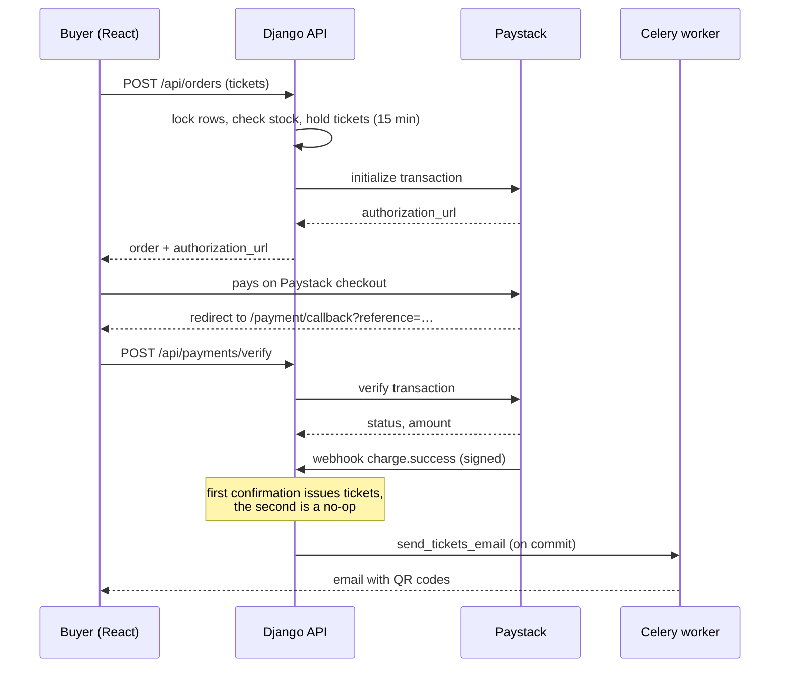

# Gatepass

**Event ticketing with Paystack payments, QR-code tickets and door check-in. Built with Django, Celery and React.**


Organizers create events with ticket tiers (Regular, VIP, free student tickets…) and publish them. Attendees pay through Paystack's checkout and receive QR-code tickets in the app and by email. At the door, organizers scan tickets with their phone camera. Each ticket admits exactly once.

<!-- Replace with your real URL once deployed:
**Live demo:** https://gatepass-xxxx.onrender.com
- Organizer: `demo` / `Demo-pass-123`: sales dashboard and check-in scanner
- Buyer: register any account. Payments run in Paystack **test mode**; use test card `4084 0840 8408 4081`, any future expiry date, CVV `408`.
(Free hosting: the first load after a quiet period can take up to a minute.)
-->

| Browse events | Checkout |
|---|---|
|  |  |
| **QR tickets** | **Organizer dashboard** |
|  |  |

## Features

**For attendees**
- Browse and search upcoming events
- Pick several ticket types in one order, then pay via Paystack (card, bank transfer, USSD)
- Free tickets are issued instantly, with no payment step
- QR tickets in the app ("My tickets") and emailed as PNG attachments
- Unfinished checkouts can be resumed until the 15-minute hold expires

**For organizers**
- Create events as drafts, add ticket tiers, then publish (publishing needs at least one ticket type)
- Live dashboard: revenue, tickets sold, tickets on hold, check-in rate, recent orders
- **Door check-in** by phone camera (QR scanning) or pasted code. It flags tickets that were already used, belong to another event, or are fake

## What's interesting under the hood

- **No overselling, even under load.** Checkout locks the ticket rows (`SELECT … FOR UPDATE`) inside a transaction before checking stock. A test fires 12 simultaneous buyers at 5 seats on real PostgreSQL. Exactly 5 succeed. With the lock removed, the same test sells 12.
- **Inventory holds.** Starting checkout reserves the tickets for 15 minutes. Abandoned checkouts are released by a Celery beat task, and also on demand before every new order, so stock is never stuck.
- **Payments are verified server-side, twice.** Paystack reports each payment in two ways: it redirects the buyer back, and it calls a webhook. Neither path trusts the browser. The redirect triggers a server-side verification call to Paystack, and the webhook is authenticated with an HMAC-SHA512 signature. The amount and currency are checked before any ticket is issued.
- **Idempotent fulfilment.** Whichever of the two confirmations arrives first issues the tickets. The other becomes a no-op, and so do Paystack's webhook retries. The order row is locked while this happens, so tickets are never duplicated.
- **Late payments are honoured.** If someone pays after their hold expired, they still get their tickets. Taking money without issuing tickets is worse than briefly exceeding capacity.
- **Money is stored in kobo** (integers), so there are no floating-point rounding errors.
- **Background jobs with Celery + Redis.** Ticket emails (with QR images) are sent off the request path, with automatic retries.
- **Payment simulator.** Without a Paystack key, checkout goes to a clearly labelled simulated payment page. That makes local development and demos work with zero setup.

## Payment flow



## Tech stack

| Layer | Tech |
|---|---|
| Backend | Django 5.2, Django REST Framework, JWT auth (simplejwt) |
| Payments | Paystack Transactions API + webhooks |
| Background jobs | Celery 5 with Redis (worker + beat scheduler) |
| Database | PostgreSQL (SQLite for quick local runs) |
| Frontend | React 18, React Router, Vite, Tailwind CSS v4, `qrcode.react`, `html5-qrcode` |
| Testing | pytest (64 tests, with Paystack mocked via `responses`), Vitest |
| DevOps | Docker Compose, GitHub Actions (tests on PostgreSQL), Render, Neon |

## API overview

| Method | Endpoint | Who | Description |
|---|---|---|---|
| POST | `/api/auth/register/`, `/api/auth/login/` | anyone | Account and JWT tokens |
| GET | `/api/events/?q=&city=` | anyone | Published upcoming events |
| GET | `/api/events/<slug>/` | anyone | Event with ticket types and availability |
| POST / PATCH / DELETE | `/api/events/`, `/api/events/<slug>/` | organizer | Manage events |
| GET | `/api/events/mine/` | organizer | My events, including drafts |
| POST | `/api/events/<slug>/ticket-types/` | organizer | Add a ticket tier |
| PATCH / DELETE | `/api/ticket-types/<id>/` | organizer | Edit quantity, or delete an unsold tier |
| GET | `/api/events/<slug>/stats/` | organizer | Sales dashboard data |
| POST | `/api/events/<slug>/checkin/` | organizer | Validate and admit a ticket |
| GET / POST | `/api/orders/` | buyer | My orders / start checkout |
| POST | `/api/payments/verify/` | buyer | Confirm a payment after the Paystack redirect |
| POST | `/api/payments/webhook/` | Paystack | Signed payment notifications |

## Getting started

### Option 1: Docker

```bash
docker compose up --build
```

Open http://localhost:5173. Demo data is created automatically, so you can log in as `demo` / `Demo-pass-123`. To use real Paystack test payments instead of the simulator, run `PAYSTACK_SECRET_KEY=sk_test_... docker compose up`.

### Option 2: Run locally

You need Python 3.11+ and Node 20+. Without Redis, Celery tasks run inline and emails print to the terminal.

```bash
cd backend
python -m venv venv
source venv/Scripts/activate        # macOS/Linux: source venv/bin/activate
pip install -r requirements.txt
python manage.py migrate
python manage.py seed_demo
python manage.py runserver
```

In a second terminal:

```bash
cd frontend
npm install
npm run dev
```

To run a real Celery worker locally (with `REDIS_URL` set), add `--pool=solo` on Windows:
`celery -A config worker --beat --pool=solo -l info`

### Tests

```bash
cd backend && pytest       # uses PostgreSQL if DATABASE_URL is set (needed for the concurrency test)
cd frontend && npm test
```

## Deployment

Hosting runs on [Render](https://render.com) (free web service; Celery uses a Render Key Value instance) and [Neon](https://neon.com) (Postgres). Everything is defined in [`render.yaml`](render.yaml). [`build.sh`](build.sh) builds the React app, which Django then serves. [`start.sh`](start.sh) migrates, seeds the demo, and runs gunicorn with one Celery worker in the same instance.

1. Create a Neon project and copy its connection string.
2. In Render, choose **New → Blueprint** and pick this repo. When asked, paste:
   - the Neon string for `DATABASE_URL`
   - your Paystack **test** secret key (`sk_test_…`) for `PAYSTACK_SECRET_KEY` (empty = simulator)
   - the **Internal URL** of a Render Key Value instance for `REDIS_URL`. Render allows one free instance per account, so it can be shared with another app (add `/1` to use a separate database number). Leave it empty and background tasks run inline instead.
3. In the Paystack dashboard (Settings → API Keys & Webhooks), set the **Test Webhook URL** to `https://<your-app>.onrender.com/api/payments/webhook/`.

| Variable | Purpose |
|---|---|
| `SECRET_KEY`, `DEBUG`, `ALLOWED_HOSTS` | Standard Django settings |
| `DATABASE_URL` | PostgreSQL connection string |
| `REDIS_URL` | Celery broker. Without it, tasks run inline |
| `PAYSTACK_SECRET_KEY` | Paystack secret key. Empty means simulated payments |
| `FRONTEND_URL` | Where Paystack redirects buyers. Set automatically on Render |
| `EMAIL_HOST`, `EMAIL_PORT`, `EMAIL_HOST_USER`, `EMAIL_HOST_PASSWORD` | SMTP for ticket emails. Without them, emails go to the log |
| `ORDER_HOLD_MINUTES` | How long checkout holds tickets (default 15) |

## Roadmap

- [ ] Event cover image uploads (S3/Cloudinary)
- [ ] Refunds via Paystack's Refund API
- [ ] Discount codes
- [ ] Multiple door staff per event (scanner-only role)
- [ ] Offline-first check-in (cache ticket codes, sync later)
- [ ] Organizer payouts with Paystack subaccounts / split payments

## Author

**Toheeb Olatunde**, Computer Science, Obafemi Awolowo University
GitHub: [@Horrly](https://github.com/Horrly)
